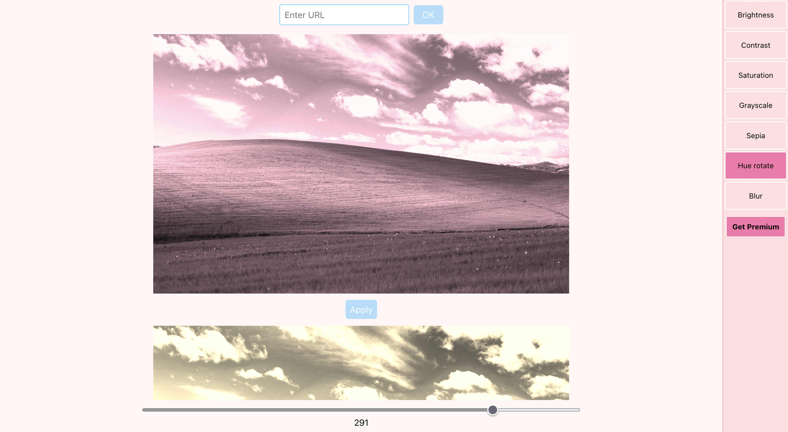
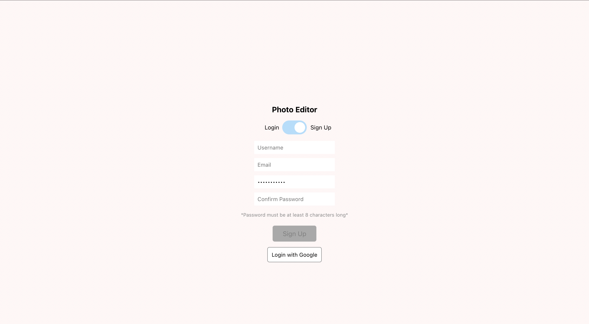

# React Photo Editor  
        A simple and intuitive photo editor built with React. This project was bootstrapped with [Create React App](https://github.com/facebook/create-react-app).  
        ## Features  
        - **Photo Uploading:** Easily upload photos to the editor. 
        - **Basic Editing Tools:** Includes cropping, resizing, and filters to enhance your photos. 
        - **Real-Time Preview:** See changes in real-time as you edit your photos. 
        - **Responsive Design:** Fully responsive, ensuring a smooth experience on both desktop and mobile devices.  
        ## Screenshots  
         
        *Main editing interface.*  
         
        *Applying filters and adjustments.*  
        ## Installation  
        To run this project locally, clone the repository and install the dependencies:  
        <code>git clone https://github.com/yourusername/react-photo-editor.git</code> 
        <code>cd react-photo-editor</code> 
        <code>npm install</code>  
        ## Usage  
        To start the development server, run:  
        <code>npm start</code>  
        This will start the app in development mode, and you can view it in your browser at `http://localhost:3000`.  
        ## Build  
        To build the app for production, run:  
        <code>npm run build</code>  
        This will create an optimized production build in the `build` folder.  
        ## Contributing  
        If you'd like to contribute to this project, feel free to fork the repository and submit a pull request.  
        ## License  
        This project is licensed under the MIT License.
